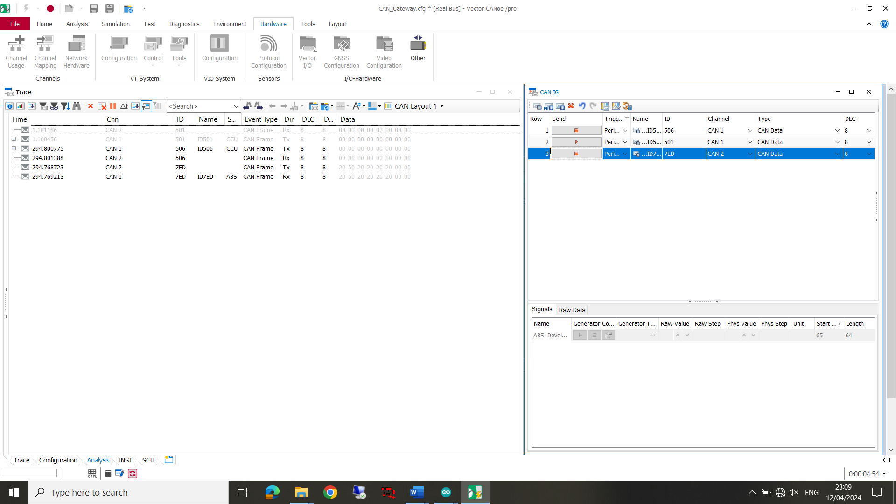

# CAN-Gateway
Arduino CAN communication with LED &amp; toggle switch in order to select weight changes

Introduction: The CAN gateway was designed in order to block current signals on the CAN-bus. Edit them and put them back onto the bus. This method was chosen opposed to using developement signals in the electronic control units and sending messages to the module. Due to timing constraints.

This proposed a slightly more complicated solution, as in order to do a CAN gateway you need to physically splice the bus. This is my proof of concept I built with an Arduino:

I followed the most logical appraoch I could think of. And that was to modurarly build the code and hardware up. Otherwise I would just get lost.

Step1. Prove that I could do a CAN gateway with arduino. 
    For this I used two MCP2515 boards. I have put the PIN out diagram in the folder. The biggest      issue here was that initially I was trying to use the same chip select PIN on the arduino to 
    drive the motherboards and send and recieve a CAN message.

    As I later found the chip sleect is used to determine which chip the SPI bus should listen to      at any given time. I was asking the boards to carry out the same tasks at the same time.

    

